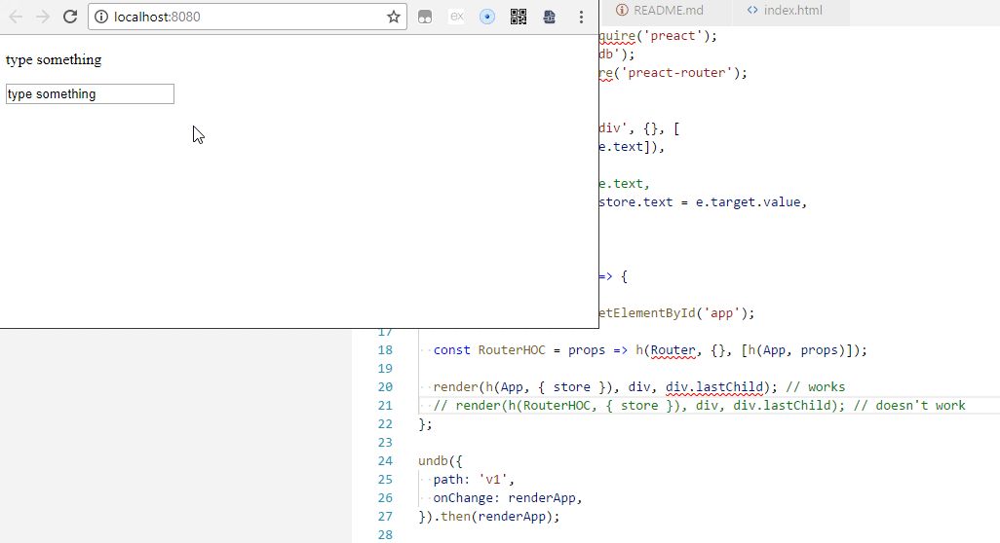

preact-router causes input to lose focus

Run the app with `npm start`

Type something in the input box

In `app.js` comment and un-comment the lines with "works" and "doesn't work" comments to see the difference.

With "works" there should be no problem

With "doesn't work" the input box will lose focus as soon as you type something.

